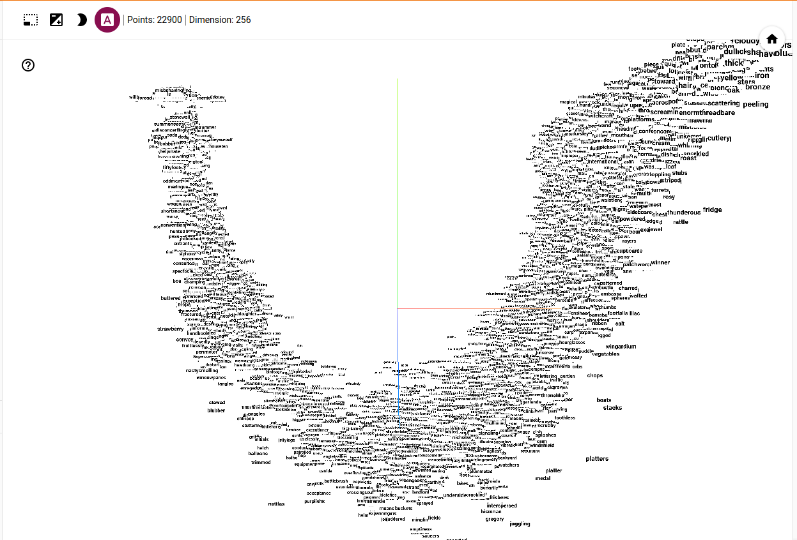

# Skip-Gram

A Skip-Gram model was trained on [all harry potter books](https://www.kaggle.com/datasets/moxxis/harry-potter-lstm).


## Evaluation

### Loss


### Latent space





## Merge saved_models zip files into a single zip file

```
zip -F saved_models.zip --out single_saved_models.zip
```